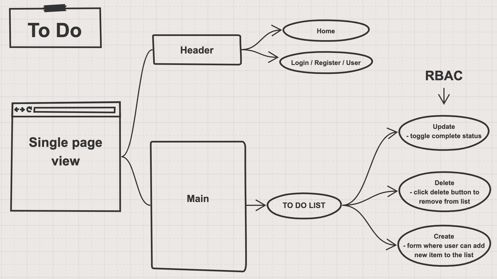

# todo
A web-based task manager application, written in React.

## Version
0.2.0

## Auther
- Tia Low

### About
Full-stack JavaScript developer with a diverse background of personal and professional experience.
- [Linkedin](https://www.linkedin.com/in/tia-low/)

## Collaborations and Resources
- Alex Whan: [GitHub](https://github.com/alex-whan)
- Josh Beasley: [GitHub](https://github.com/beasleydotcom)

## Description

### **Phase 1: Application Setup**
- Basic To Do List Management, setup foundational system using Hooks

### **Phase 2: Persistence**
- Implement a custom Form Hook
- Implement a custom Ajax Hook
- Connect to a live API for storing To Do Items

### **Phase 3: Settings and Global Context**
- Implement user settings for displaying items

### **Phase 4: Authorization**
- Require a login to access the list
- Restrict access to adding, editing, deleting to certain user types

## UML

